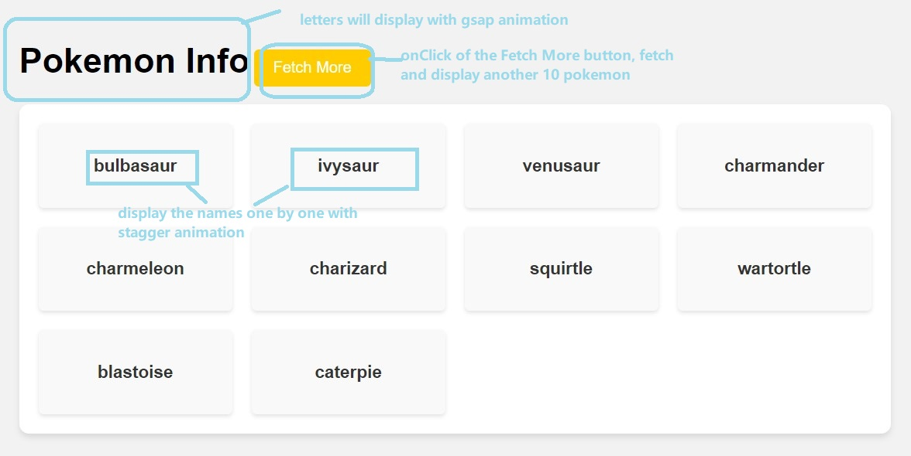
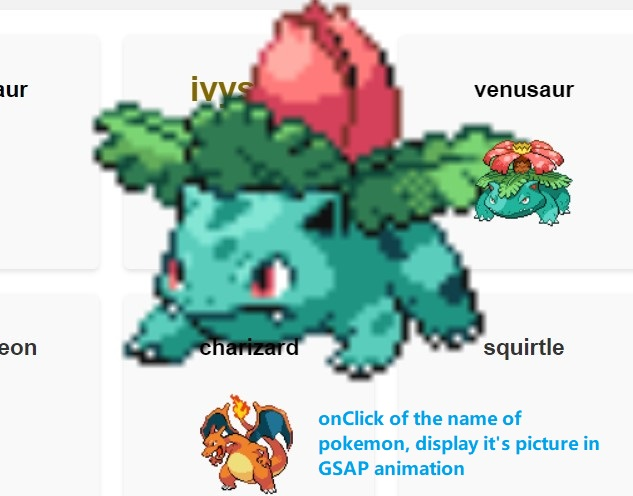
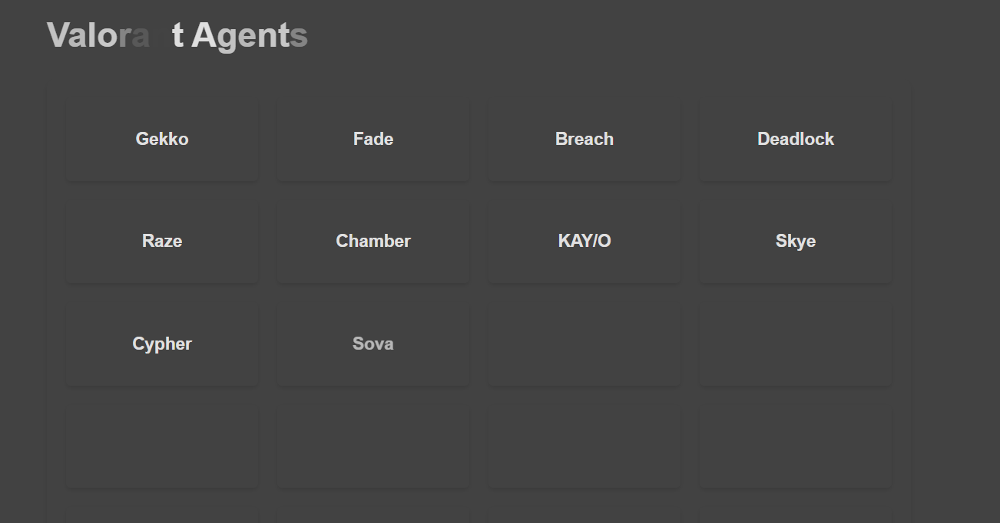
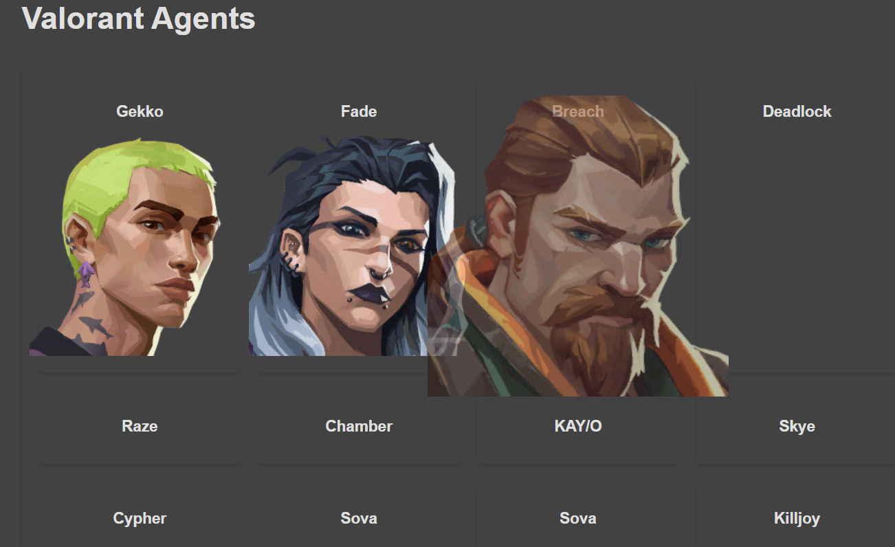

## Assignment: Animating Pokémon/Valorant List using GSAP

### Objective

In this assignment, you will use the GreenSock Animation Platform (GSAP), fetch data from the PokeAPI/Valorant API, and create animations to display a list of Pokémon/Valorant Agents.

> **NOTE:** Instruction below is just a guideline. Please feel free to play around, and outcome can be flexible with your own choices

### Setup

1. install dependencies

   ```zsh
   npm i
   ```

2. run in development mode

   ```zsh
   npm run dev
   ```

> Will open a new browser with index.html inside `src/pages/index.html`. Please do not change file paths!

### Resources

**POKEMON API**

1. [Endpoint](<https://pokeapi.co/docs/v2#pokemon:~:text=re)-,Pokemon%20(endpoint),-Pok%C3%A9mon%20are%20the>)

2. [Pagination](<https://pokeapi.co/docs/v2#resource-listspagination-section:~:text=Resource%20Lists/Pagination%20(group)>)

```zsh
https://pokeapi.co/api/v2/pokemon?offset=${offset}&limit=10
```

**VALORANT API**

1. [Endpoint](https://dash.valorant-api.com/endpoints/agents)

```zsh
https://valorant-api.com/v1/agents
```

## Requirements for Pokemon Page

1. use `fetch` to get 10 Pokémons and populate their names on the page

   **Hint**: Write an asynchronous function `fetchPokemonData` that fetches data from the PokeAPI. This function should return an array of Pokémon data.

   ```js
   // Fetch data from the PokeAPI
   const fetchPokemonData = async (offset) => {
     const response = await fetch(
       `https://pokeapi.co/api/v2/pokemon?offset=${offset}&limit=10`
     );

     return response.json();
   };
   ```

2. When you click on the fetch more button, the offset will increase by 10 and fetch another 10 pokemon.

   

3. When you click on the pokemon card, fetch and display the picture of the specific pokemon under the name

   

4. add GSAP animations to `Pokemon Image` and `name`

   - Ensure that the Pokémon Image and Pokémon names fade in with a staggered effect.

5. (Optional) add GSAP animations when click on the `Fetch More` button and the images

   - Add scroll animation to the `Fetch More` button.
   - The `Fetch More` button should be visible always
   - Enhance the animation by adding more properties such as scaling, rotation, or color changes to the Pokémon list items.
   - Display other properties.

6. Testing and Submission

## Requirements for Valorant Page

1. use fetch to get agents and populate their names on the page

   

2. When click on the agent card, display the picture of the specific agent under the name

   

3. add GSAP animations to `Valorant agent Image` and `name`

   > _instructions are same as pokemon API from here_


## Tips: 
 - Implement the fetch call and the click functionalities before proceeding with implementing GSAP animations into your program. This will help you steer your development progressively

 - You may find the following GSAP intro videos helpul to understand some basics: 
 <br>
 https://gsap.com/docs/v3/GSAP/
